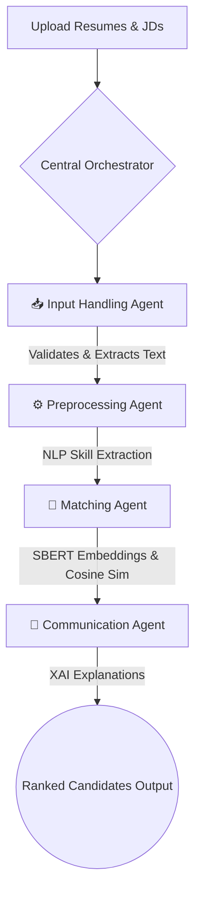

# SkillFitAI: AI-Powered Resume Screening & JD Matching

**Intelligent Ranking for Smarter Recruitment**

---

## 📖 Project Overview
**SkillFitAI** is a sophisticated, AI-powered recruitment and career development platform that fundamentally transforms the hiring process. It maximizes candidate-job matching and enables scalable adoption across organizations of all sizes (especially SMEs). 

By transitioning away from time-consuming and error-prone manual screening, SkillFitAI provides an automated, ethical, and highly efficient decision-support tool. It parses multi-format resumes, semantically matches candidates to job descriptions, mitigates hiring bias, and provides transparent preliminary profile assessments using Explainable AI (XAI).

### Key Highlights
- **65% reduction** in recruiter screening time (average 1.8 seconds per resume).
- **0.88 F1-Score** (24% improvement over traditional TF-IDF keyword baselines).
- **0.91 MRR** (Mean Reciprocal Rank) with 100% ranking determinism.
- Built with a focus on ethical AI, ensuring a **1.05 Disparate Impact Ratio** (< 5% bias drift) to promote fairness.

---

## 🏗️ Architecture & Methodology

SkillFitAI employs a modern **Agentic Architecture** designed for scalability, transparency, and efficiency. The system relies on four specialized agents coordinated by a Central Orchestrator:



### 1. The Agentic Workflow
*   **📥 Input Handling Agent:** Validates and converts multi-format files (PDF, DOCX, TXT) into structured plain text without data loss.
*   **⚙️ Preprocessing Agent:** Utilizes advanced NLP techniques to extract key entities such as skills, education history, and work experience.
*   **🧠 Matching Agent:** Generates dense semantic embeddings using `all-MiniLM-L6-v2` and computes cosine similarity for candidate ranking.
*   **💬 Communication Agent:** Generates human-readable match explanations using Explainable AI (XAI), delivering actionable feedback to both recruiters and candidates.

### 2. The 5-Step Processing Pipeline
1.  **Text Extraction:** Extracts text from varied, unstructured resume formats.
2.  **Text Cleaning & Preprocessing:** Normalizes data and resolves skill ambiguity (synonyms, abbreviations).
3.  **Embedding Generation:** Converts text into semantic vectors (using Sentence-BERT).
4.  **Scoring:** Calculates the Fit Score using a combination of Cosine Similarity and Skill Overlap calculation.
5.  **Ranking & Explanation:** Outputs a deterministically ranked list of candidates accompanied by transparent evidence summaries.

---

## 📊 Model Evaluation & Benchmarking
The system was rigorously evaluated against a dataset of 230 documents (50 Job Descriptions, 180 synthetic resumes across 12 job roles).

*   **Embedding Model Selection:** `all-MiniLM-L6-v2` was chosen over DistilBERT and standard Word2Vec for its optimal balance of semantic understanding and rapid processing (2-3 seconds per resume).
*   **Skill Extraction Accuracy:** Achieved **92.4%** accuracy in parsing and categorizing candidate skills.
*   **Embedding Consistency:** Variance of 0.014 confirms highly stable semantic representations across varied inputs.

---

## 💻 Technology Stack
*   **Backend Frameworks:** FastAPI, Uvicorn
*   **Frontend/UI:** Streamlit
*   **NLP & Machine Learning:** spaCy, scikit-learn, sentence-transformers, pandas
*   **Document Parsing:** pdfplumber, python-docx
*   **Database:** SQLAlchemy, psycopg2

---

## ⚙️ Setup & Installation

### Prerequisites
*   Python 3.8 or higher installed on your system.

### Installation
1. Clone the repository:
   ```bash
   git clone <your-repository-url>
   cd SkillFitAI-main
   ```
2. Create and activate a virtual environment (optional but recommended):
   ```bash
   python -m venv venv
   source venv/bin/activate  # On Windows: venv\Scripts\activate
   ```
3. Install the required dependencies:
   ```bash
   pip install -r requirements.txt
   ```

---

## 🚀 Usage

### 1. Running the Core Application
To run the main matching engine and process documents in the `data/` directory:
```bash
python main.py --resumes data/Resumes --jobs data/JobDescriptions
```

### 2. Output & Results
Upon successful execution, SkillFitAI generates the following inside the `results/` folder:
*   **`main_matching_results.json` / `.csv`**: Complete datasets detailing fit scores, matched skills, and missing skills for every combination.
*   **`top_matches.json`**: A filtered list of the highest-ranking candidates for immediate recruiter review.
*   **`main_summary_report.txt`**: A high-level text summary of the processing batch.

---

## 🔮 Future Scope
*   **LLM-based Re-ranking:** Integrating GPT-4 / Llama 3 for enhanced, context-aware matching.
*   **Recruiter Personalization:** Tailoring the ranking weights based on specific recruiter preferences.
*   **Multi-language Support:** Expanding semantic matching beyond English resumes.
*   **ATS Integrations:** Direct API integrations with enterprise platforms like Workday and Lever.
*   **Technical Optimization:** Model quantization and hardware acceleration for massive batch processing.

---
*Developed as a Master's Capstone AI project. For academic and demonstration purposes only.*
